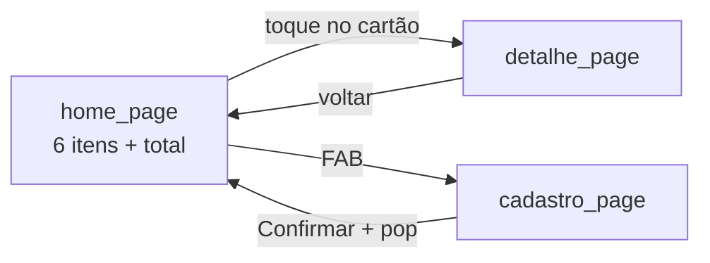

# Parte 2 — Flutter (Exercícios 5–10)

> Epic Jira: **Parte 2 — Interface Flutter**
> Fontes: enunciado § Parte 2, `contexto-projeto-divide.md` §5.

---

## 1. Visão geral

App Flutter com **exatamente 3 telas**: lista, detalhe e cadastro. Usa as **mesmas classes** da Parte 1 (cópia em `lib/models/`). Nenhum dado de domínio pode estar hardcoded nos widgets — tudo vem dos models.

## 2. Escopo

### Dentro do escopo (obrigatório)
- `home_page.dart` — lista + totais + FAB
- `detalhe_page.dart` — detalhe com ≥2 campos extras vs cartão
- `cadastro_page.dart` — formulário com ≤3 campos
- `widgets/cartao_despesa.dart` — cartão do item
- `ContaCompartilhada` com **6 despesas** ao abrir
- `flutter analyze` sem errors

### Extra (não pontua, permitido com cuidado)
- Logo na AppBar ou ícone do app
- Splash automático 1–2s (**não** contar como 4ª tela navegável)
- Editar/excluir despesa (CRUD completo)

### Fora do escopo / proibido para pontuação
- 4ª tela navegável (splash com rota própria, login, configurações)
- Persistência entre sessões
- Substituir lista de 6 itens por lista vazia ao cadastrar

## 3. Estrutura de arquivos esperada

```text
parte2-flutter/
├── pubspec.yaml
└── lib/
    ├── main.dart
    ├── models/                    ← cópia da Parte 1
    │   ├── despesa.dart
    │   ├── despesa_parcelada.dart
    │   └── conta_compartilhada.dart
    ├── screens/
    │   ├── home_page.dart
    │   ├── detalhe_page.dart
    │   └── cadastro_page.dart
    └── widgets/
        └── cartao_despesa.dart
```

## 4. Dados iniciais (template)

`ContaCompartilhada` de exemplo — **6 despesas**, participantes coerentes (ex.: 4 pessoas):

| # | Descrição | Valor | Pagador | Categoria |
|---|---|---|---|---|
| 1 | Pizza | 45.00 | Ana | Restaurante |
| 2 | Uber | 28.50 | Bruno | Transporte |
| 3 | Mercado | 87.30 | Carla | Compras |
| 4 | Gasolina | 120.00 | Diego | Transporte |
| 5 | Cinema | 64.00 | Ana | Lazer |
| 6 | Farmácia | 35.20 | Bruno | Saúde |

**Total inicial:** R$ 380,00 → valor por pessoa (4 participantes): R$ 95,00

> Pode incluir 1 `DespesaParcelada` entre as 6 para reforçar herança na UI (opcional).

Nome sugerido da conta: `"Jantar e passeio — setembro"`.

## 5. Fluxo de telas (smoke)



## 6. Requisitos funcionais

| ID | Exercício | Descrição |
|---|---|---|
| RF-EX-05 | 5 | `Scaffold`+`AppBar`; `Column` com alinhamentos; total no topo |
| RF-EX-06 | 6 | Widget cartão com `Container`+`BoxDecoration` |
| RF-EX-07 | 7 | `ListView.builder` com 6 itens ao abrir |
| RF-EX-08 | 8 | `Navigator.push` passando `Despesa` ao detalhe |
| RF-EX-09 | 9 | `TextFormField`+`TextEditingController`; ≤3 campos |
| RF-EX-10 | 10 | `StatefulWidget`+`setState`; item 7º + total atualizado |

## 7. Mapa de telas

| Tela | Arquivo | Exercícios |
|---|---|---|
| Lista | `screens/home_page.dart` | 5, 7, 8, 10 |
| Detalhe | `screens/detalhe_page.dart` | 8 |
| Cadastro | `screens/cadastro_page.dart` | 9 |

Especificação wireframe: [`flutter/especificacao-telas.md`](../flutter/especificacao-telas.md).

## 8. Exercícios detalhados

| # | Documento |
|---|---|
| 5 | [05-estrutura-tela.md](exercicios/05-estrutura-tela.md) |
| 6 | [06-cartao.md](exercicios/06-cartao.md) |
| 7 | [07-lista.md](exercicios/07-lista.md) |
| 8 | [08-navegacao.md](exercicios/08-navegacao.md) |
| 9 | [09-formulario.md](exercicios/09-formulario.md) |
| 10 | [10-estado.md](exercicios/10-estado.md) |

## 9. Cards Scrumban (Epic Parte 2)

| Card | Exercício | Tamanho | Dependências |
|---|---|---|---|
| DIV-C-05 | 5 — Estrutura de tela | M | cópia models |
| DIV-C-06 | 6 — Cartão | P | DIV-C-05 |
| DIV-C-07 | 7 — Lista | M | DIV-C-05, DIV-C-06 |
| DIV-C-08 | 8 — Navegação | M | DIV-C-07 |
| DIV-C-09 | 9 — Formulário | M | DIV-C-05 |
| DIV-C-10 | 10 — Estado | M | DIV-C-07, DIV-C-09 |

Ver [`scrumban/backlog-parte2.md`](../scrumban/backlog-parte2.md).

## 10. Definição de pronto — Parte 2

1. App abre com 6 itens e totais no topo.
2. Toque no **meio** da lista abre detalhe com dados corretos.
3. FAB → cadastro → confirmar → 7º item + total novo **sem reiniciar**.
4. `flutter analyze` → 0 errors.
5. Tabela de rastreio linhas 5–10 preenchidas.
