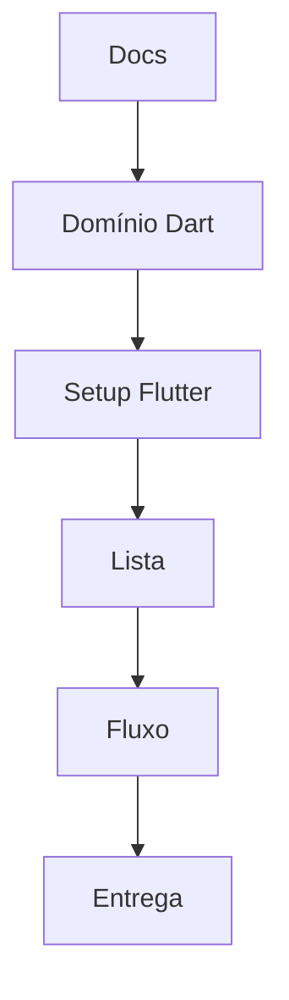

# Plano de execução — DivideAí

## Fases

| Fase | Entregável | Docs | Cards |
|---|---|---|---|
| 0 | Este pacote de requisitos | `00-visao-geral/` | — |
| 1 | Domínio + CLI + testes | `01-parte1-dart/`, `dart/` | DIV-C-01..04c |
| 2 | Models no Flutter | `flutter/models-e-entidades.md` | prep |
| 3 | Lista | features 5–7 | DIV-C-05..07 |
| 4 | Detalhe + cadastro + estado | features 8–10 | DIV-C-08..10 |
| 5 | README + qualidade | `99-validacao/` | DIV-ENT-01..02 |

## Paralelização

- Após F1: um fluxo pode copiar models / montar home enquanto outro fecha testes
- DIV-C-08 e DIV-C-09 em paralelo após DIV-C-07
- DIV-ENT-01 começa cedo; linhas da tabela ao fechar cada card

## Gates

| Fase | Gate |
|---|---|
| 1 | analyze + test + relatório 4 blocos |
| 3 | 6 cartões + total |
| 4 | fluxo 6→7 |
| 5 | checklist 100% |

## Jira

1. Epics: Parte 1, Parte 2, Entrega  
2. Cards de `scrumban/cards-por-epic.md`  
3. Aceite de cada feature no card  
4. Done → atualizar `arquivo:linha` no README  
5. Labels/links para `bdd/*.feature`  

Detalhe: [`briefing-cards-jira.md`](briefing-cards-jira.md).
