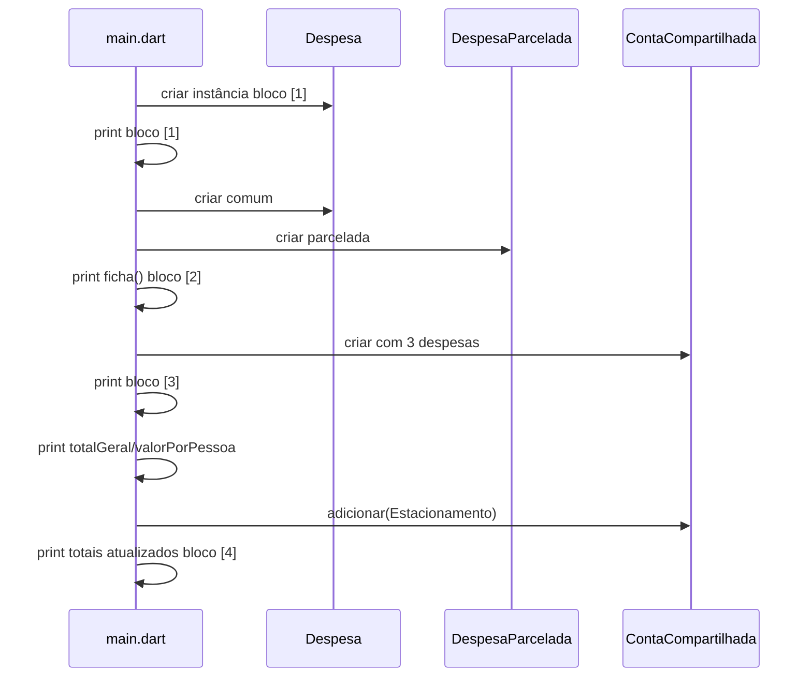

# Arquitetura — Parte 1 (Dart puro)

## Princípios

1. **Domínio primeiro** — toda lógica de negócio nas classes de `bin/models/`; `main.dart` apenas orquestra e imprime.
2. **Um executável** — somente `bin/main.dart` via `dart run`.
3. **Sem dependências de runtime** além do SDK Dart (dev: `test`, `lints`).
4. **Preparar cópia** — API pública das classes deve ser estável antes de copiar para Flutter.

## Estrutura de pastas (alvo)

```text
parte1-dart/
├── pubspec.yaml
├── analysis_options.yaml
├── bin/
│   ├── main.dart                 # relatório 4 blocos
│   └── models/
│       ├── despesa.dart
│       ├── despesa_parcelada.dart
│       └── conta_compartilhada.dart
└── test/
    ├── despesa_test.dart
    ├── despesa_parcelada_test.dart
    ├── conta_compartilhada_test.dart
    └── encapsulamento_test.dart
```

## Responsabilidades por arquivo

| Arquivo | Responsabilidade |
|---|---|
| `main.dart` | Instanciar objetos de demonstração; imprimir blocos [1]–[4]; chamar `adicionar()` no bloco [4] |
| `despesa.dart` | Entidade base; método `ficha()` |
| `despesa_parcelada.dart` | Especialização; `@override ficha()` |
| `conta_compartilhada.dart` | Agrupador; `_despesas`; `adicionar()`; getters calculados |

## Fluxo de execução (`main.dart`)



## Formatação de saída

- Usar `print()` com cabeçalhos fixos `===== [N] TÍTULO =====`
- Valores monetários: `R$ XX.XX` com 2 casas (`toStringAsFixed(2)`)
- Datas: formato `dd/MM/yyyy` no relatório

## pubspec.yaml (dev)

```yaml
name: parte1_dart
environment:
  sdk: ^3.0.0
dev_dependencies:
  test: ^1.24.0
  lints: ^3.0.0
```

## Comandos

```bash
cd parte1-dart
dart pub get
dart analyze
dart test
dart run bin/main.dart
```

## Estado atual do repositório

| Item | Status |
|---|---|
| `bin/main.dart` | **Pendente** — existe `bin/parte1_dart.dart` com stub |
| `bin/models/` | **Pendente** |
| Testes | **Pendente** |

Ver `99-validacao/lacunas.md` para alinhamento de nomes de pasta.
