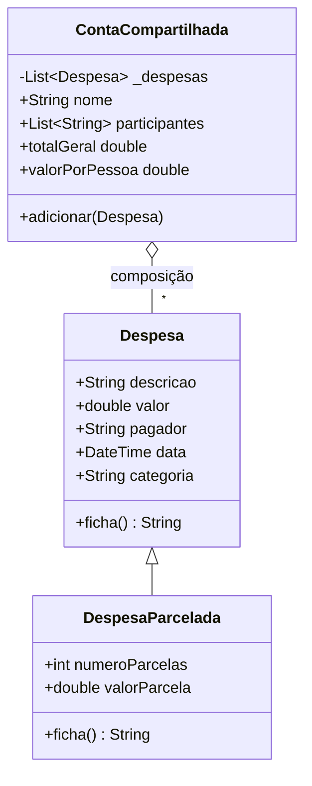

# Especificação de classes — Domínio DivideAí

Documento canônico de assinaturas. Implementação em `parte1-dart/bin/models/`; cópia idêntica em `parte2-flutter/lib/models/`.

---

## `Despesa` (Exercício 1)

```dart
/// Item individual de gasto em uma divisão de conta.
class Despesa {
  final String descricao;
  final double valor;
  final String pagador;
  final DateTime data;
  final String categoria;

  Despesa({
    required this.descricao,
    required this.valor,
    required this.pagador,
    DateTime? data,
    this.categoria = 'Geral',
  }) : data = data ?? DateTime.now();

  /// Descrição resumida para relatório e herança.
  /// Ex.: "Pizza | R$ 45.00 | pago por Ana"
  String ficha() {
    return '$descricao | R\$ ${valor.toStringAsFixed(2)} | pago por $pagador';
  }

  @override
  String toString() =>
      'Despesa: $descricao | R\$ ${valor.toStringAsFixed(2)} | pago por $pagador | '
      '${_formatarData(data)} | Categoria: $categoria';

  String _formatarData(DateTime d) =>
      '${d.day.toString().padLeft(2, '0')}/'
      '${d.month.toString().padLeft(2, '0')}/'
      '${d.year}';
}
```

| Atributo | Tipo | Required | Default |
|---|---|---|---|
| descricao | String | sim | — |
| valor | double | sim | — |
| pagador | String | sim | — |
| data | DateTime | não | now() |
| categoria | String | não | 'Geral' |

---

## `DespesaParcelada` (Exercício 2)

```dart
class DespesaParcelada extends Despesa {
  final int numeroParcelas;
  final double valorParcela;

  DespesaParcelada({
    required super.descricao,
    required super.valor,
    required super.pagador,
    super.data,
    super.categoria,
    required this.numeroParcelas,
    required this.valorParcela,
  });

  @override
  String ficha() {
    return '${super.ficha()}, em $numeroParcelas parcelas de R\$ '
        '${valorParcela.toStringAsFixed(2)}';
  }
}
```

**Validação de modelagem:** `DespesaParcelada` IS-A `Despesa`.

---

## `ContaCompartilhada` (Exercícios 3 e 4)

```dart
class ContaCompartilhada {
  final String nome;
  final List<String> participantes;
  final List<Despesa> _despesas;

  ContaCompartilhada({
    required this.nome,
    required this.participantes,
    List<Despesa>? despesasIniciais,
  }) : _despesas = List<Despesa>.from(despesasIniciais ?? []);

  void adicionar(Despesa despesa) {
    _despesas.add(despesa);
  }

  /// Lista somente leitura para a UI.
  List<Despesa> get despesas => List<Despesa>.unmodifiable(_despesas);

  int get quantidadeDespesas => _despesas.length;

  double get totalGeral =>
      _despesas.fold(0.0, (soma, d) => soma + d.valor);

  double get valorPorPessoa {
    if (participantes.isEmpty) return 0.0;
    return totalGeral / participantes.length;
  }
}
```

### Invariantes

| Regra | ID |
|---|---|
| `totalGeral` nunca é campo armazenado | RN-DOM-02 |
| `adicionar` é o único mutador público da coleção | RN-DOM-06 |
| `participantes.length >= 1` na prática (evitar divisão por zero) | Inferido |

---

## Factory de dados — Parte 1 (`main.dart`)

Objetos para o relatório (podem diferir dos 6 itens do Flutter):

- Bloco [1]: uma `Despesa` isolada (Pizza)
- Bloco [2]: `Despesa` comum + `DespesaParcelada` (mesma passagem de ônibus)
- Bloco [3]: `ContaCompartilhada` com 3 despesas
- Bloco [4]: mesma conta do [3]; adicionar Estacionamento R$ 30

## Factory de dados — Parte 2 (`home_page.dart`)

Função estática sugerida: `ContaCompartilhada criarContaExemplo()` com **6 despesas** e 4 participantes — ver `02-parte2-flutter/README.md` §4.

---

## Diagrama de classes


