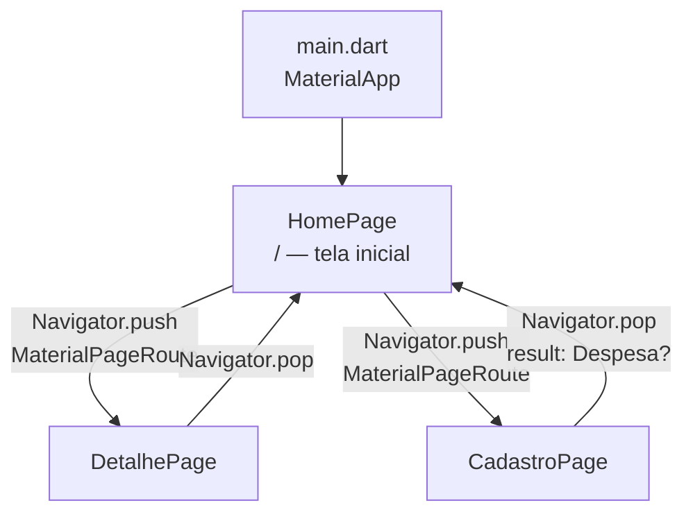

# Mapa de rotas — DivideAí

Navegação **imperativa** (sem `go_router`). Apenas 3 telas avaliadas.

## Diagrama



## Tabela de rotas

| Rota lógica | Widget | Tipo | Parâmetros | Retorno |
|---|---|---|---|---|
| `/` (home) | `HomePage` | `StatefulWidget` | — | — |
| `/detalhe` | `DetalhePage` | `StatelessWidget` | `Despesa despesa` | — |
| `/cadastro` | `CadastroPage` | `StatefulWidget` | — | `Despesa?` via `pop` |

## Snippets

### Home → Detalhe

```dart
Navigator.of(context).push(
  MaterialPageRoute(
    builder: (context) => DetalhePage(despesa: despesa),
  ),
);
```

### Home → Cadastro → Home

```dart
final result = await Navigator.of(context).push<Despesa>(
  MaterialPageRoute(builder: (context) => const CadastroPage()),
);
if (result != null) {
  setState(() => _conta.adicionar(result));
}
```

### Cadastro → confirmar

```dart
Navigator.of(context).pop(despesa);
```

## Smoke do fluxo feliz

1. `HomePage` — 6 itens + total
2. Toque em um item (preferencialmente do meio) → `DetalhePage`
3. Voltar → FAB → `CadastroPage`
4. Preencher → Confirmar → `HomePage` com 7 itens + total novo
